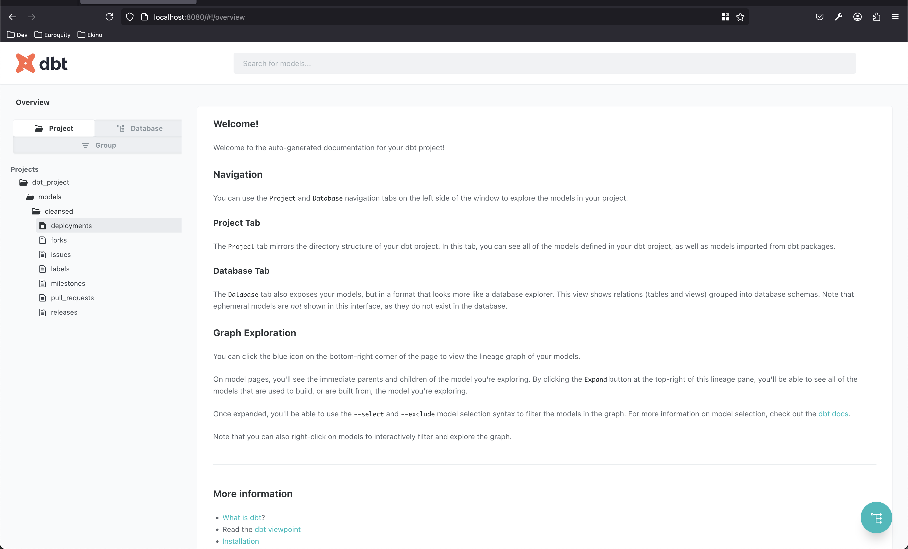
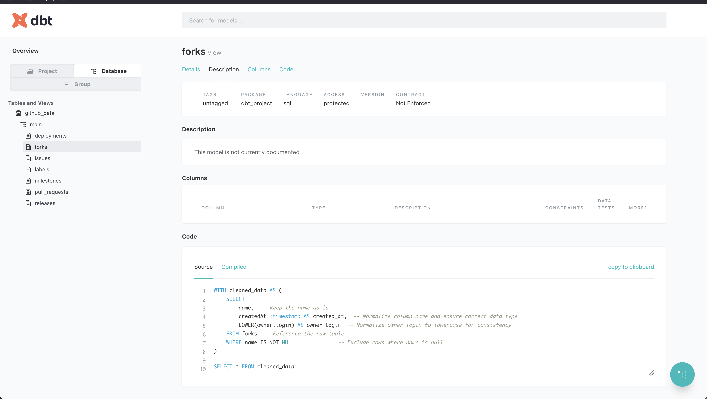
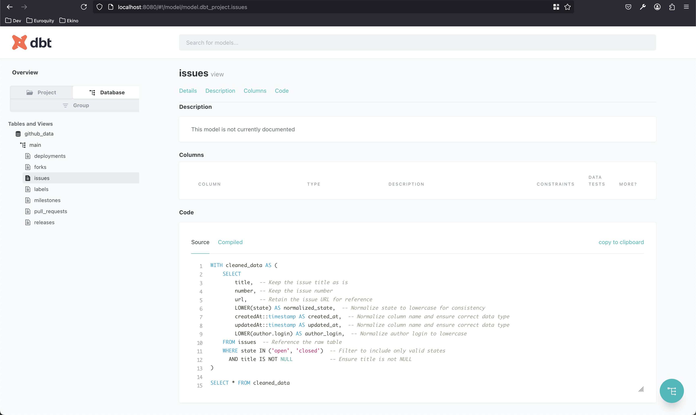

# Setup
## Environnement
- Créez un fichier `.env` en copiant le `.env.dist` avec votre access token Github

## Python
- Assurez vous d'avoir `python3` d'installé
- Lancez `python3 -m venv .` pour créer votre environnement virtuel (facultatif)
- Lancez `source ./bin/activate` pour activer le venv (facultatif)
- Enfin, éxecutez `pip install -r requirements.txt` pour installer les dépendances

## Outil et les sources de données identifiées
L'outil étudié est rocket chat, les sources de données identifiées sont :
- les labels
- les pull requests
- les milestones
- les releases
- les issues
- les forks
- les deployments

## Dbt
Nous avons pu intégrer l'outil dbt au sein du projet afin qu'il s'appuie sur note base de données `github_data.duckdb`, voici quelques captures d'écrans :
 Page d'accueil :  

 Data forks : 

 Data issues : 

